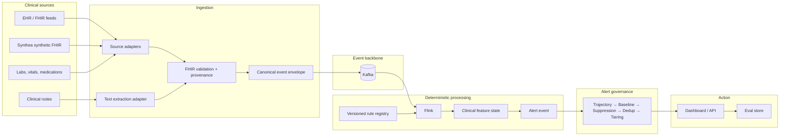

# Curie Prediction Pipeline

Streaming platform that ingests FHIR clinical data, computes deterioration risk in real time, and surfaces alerts a clinician will actually trust.

Sepsis-3 is a separate phenotype (infection + acute SOFA rise). Absolute SOFA scoring surfaces as **sofa-deterioration**, not a sepsis diagnosis. Adding indicator #2 is meant to be authoring a rule bundle — not rebuilding infrastructure.

> **Prototype only.** Synthetic data, no real PHI, not clinically validated, not FDA-cleared, not for patient care. See [Regulatory posture](#regulatory-posture).

## The core bet

The defensible part of this system is not any single score — it is the shared **alert governance layer** that decides whether a computed risk is worth interrupting a clinician for:

- Trajectory / persistence checks
- Patient baseline-relative scoring
- Context suppression
- Dedup + refractory windows
- Acuity tiering
- Feedback loop (dismiss-rate)

Every future indicator inherits that layer. That is the publishable contribution and the startup wedge.

## Stack

| Layer | Choice |
|---|---|
| Event backbone | Apache Kafka |
| Stream processing | Apache Flink (event time, watermarks, windows, CEP) |
| First indicator | SOFA deterioration (`sofa-deterioration`); Sepsis-3 phenotype separate |
| Test data | Synthea (mechanical / integration only — not clinical validation) |
| Rules (v1) | Versioned JSON rule bundles (CQL is v2+) |
| LLM (v2) | Extraction + post-alert narrative only — **never** on the alert-firing path |

## Architecture



**LLM boundary (hard rule):** the Flink alert is complete on its own (score, severity, evidence, rule version). The Guarded Reasoning Pipeline (GRP, v2) only adds narrative on top of an alert that already fired. It cannot create, suppress, or change a score.

## v1 goals

1. Replay synthetic FHIR events with realistic event-time behavior through Kafka → Flink
2. Compute a versioned, deterministic sepsis risk score with explicit missing-component handling
3. Emit alerts with score, severity, evidence IDs, and rule version
4. Prove the governance layer reduces alert volume vs. a naive threshold-only baseline
5. Ship a minimal dashboard/API with alerts + evidence + acknowledge
6. Treat the replay/backtest harness as first-class infrastructure

**Non-goals:** real PHI, hospital integration, FDA/SaMD clearance, LLM-in-the-loop for alerting, full CQL, multi-tenant production hardening.

## Success metrics

| Metric | Why it matters |
|---|---|
| Alert reduction ratio | Governance alerts ÷ naive-threshold alerts — headline result for the writeup |
| Number-needed-to-alert | Alerts fired per true positive caught |
| Calibration | Predicted risk vs. observed outcome rate on labeled scenarios |
| Time-to-detection | Trigger event-time vs. qualifying data available |
| Replay determinism | Same input twice → identical output (**hard bar: 100%**) |

## Repo layout

```
curie-prediction-pipeline/
  ingestion/
    adapters/            # Synthea, vendor-shaped, etc.
    extraction/          # text-to-FHIR LLM adapter (phase 2)
    envelope/            # canonical event envelope schema + validation
  streaming/
    flink-jobs/
      sofa/              # sepsis SofaJob + AKI AkiJob (score + alert operators)
      governance/        # shared trajectory/baseline/suppression/dedup/tiering
    rule-registry/       # versioned JSON rule bundles + broadcast publisher
  reasoning/             # phase 2: GRP (context → model → claim validator → gate)
  action/
    api/                 # alert read API, acknowledge endpoint
    dashboard/           # minimal UI
  eval/
    scenario-library/    # T2 scenarios + expected outcomes
    replay_harness/      # backtest runner, governance metrics
    fixtures/            # T0 contract fixtures
    sofa/                # reference SOFA scorer (aligned with Flink)
    mimic_demo/          # score SOFA/AKI on PhysioNet MIMIC-IV demo
  data/                  # local only (gitignored): synthea/, mimic-iv-demo/
  docs/
    prd.md
```

**MIMIC-IV demo (optional):** place the PhysioNet open demo at `data/mimic-iv-demo/` (or set `CURIE_MIMIC_DEMO_DIR`), then:

```bash
make mimic-demo
# or: LIMIT=20 make mimic-demo
```

**Challenge 2019 sepsis eval (optional):** place the PhysioNet Challenge 2019 training sets at `data/archive/` (or set `CURIE_CHALLENGE2019_DIR`), then:

```bash
make challenge-2019          # default: first 200 stays, PROFILE=accuracy
LIMIT=0 make challenge-2019  # all ~40k stays
PROFILE=dual LIMIT=0 make challenge-2019
SET=training_setA make challenge-2019
JOBS=11 LIMIT=0 make challenge-2019-sweep          # setA tune → freeze → setB
JOBS=5 LIMIT=0 make challenge-2019-robustness      # grace / early / ±12h windows
GOV_CONFIG=eval/challenge2019/frozen/p1_setA_winner.json SET=training_setB LIMIT=0 make challenge-2019
```

Reports naive vs governed (watch ∪ page) and interruptive page metrics vs `SepsisLabel`. Locked operating point: [`eval/challenge2019/frozen/p1_setA_winner.json`](eval/challenge2019/frozen/p1_setA_winner.json). Profiles: `accuracy`, `dual`, `sensitive`, `balanced`, `strict`. See [`docs/challenge-2019-eval.md`](docs/challenge-2019-eval.md).

## Build order

Tracked in detail in [`docs/phases.md`](docs/phases.md). The active, Cursor-ready engineering
backlog is [`docs/implementation-backlog.md`](docs/implementation-backlog.md). Clinical validity
(separate from engineering CI): [`docs/clinical-validation.md`](docs/clinical-validation.md).
Cross-project LLM workflows with
[`curie-fhir`](https://github.com/sreeram843/curie-fhir) are documented in
[`docs/llm-workflows.md`](docs/llm-workflows.md).

| Phase | Goal | Status |
|---|---|---|
| **0** Scaffolding | Repo layout, Docker Compose (Kafka + Flink), Synthea script, CI | Done |
| **1** Deterministic vertical slice | Envelope → replay → SOFA Flink job → governance → API/dashboard → alert-reduction metric | Done |
| **2** LLM layer | Text→FHIR extraction + Guarded Reasoning Pipeline (additive only) | Done |
| **3** Modularity proof | Second indicator (e.g. AKI) via rule bundle only | Done |

## Getting started (Phase 0)

**Prereqs:** Docker, Python 3.11+, Java 17 + Maven (for Flink modules), Git.

```bash
# Python tooling
python -m venv .venv && source .venv/bin/activate
pip install -e ".[dev]"

# Local Kafka + Flink + Kafka UI (infra)
make up
# Kafka UI: http://localhost:8080
# Flink UI: http://localhost:8081
# Kafka:   localhost:9092

# Full stack in Compose (API :8000 + seed rules + package/submit SofaJob + AkiJob)
make up-full
# Dashboard: http://localhost:8000  |  Kafka UI: :8080  |  Flink UI: :8081

# Synthetic FHIR (mechanical/integration only — needs Java for Synthea; still host-side)
make synthea N=10

# Checks
make test
make lint

# Replay Synthea FHIR into Kafka (after make synthea + make up / up-full)
pip install -e ".[kafka]"
python -m ingestion.adapters.synthea.replay_producer --fhir-dir data/synthea/fhir --dry-run
python -m ingestion.adapters.synthea.replay_producer --fhir-dir data/synthea/fhir

# Hybrid DX (optional): seed rules / Flink tests / host API with reload
make rules
make flink-test
pip install -e ".[api]"
make api
# open http://127.0.0.1:8000

# Alert-reduction metric on T2 scenarios
make replay
make replay-aki
```

Useful Make targets: `up`, `up-full`, `down`, `logs`, `topics`, `test`, `lint`, `synthea`.

## Test data tiers

| Tier | Purpose | v1 |
|---|---|---|
| T0 Contract fixtures | Unit tests for parsing, schemas, timestamps | Build |
| T1 Synthea baseline | E2E flow, replay, throughput | Build |
| T2 Scenario library | Known +/− / borderline / edge cases | Build |
| T3 Interface realism | Late, duplicate, corrected, malformed events | Stub |
| T4 Unstructured extraction | Text→FHIR accuracy | Defer (v2) |
| T5 External validation | Clinical validity on real-world data | Out of scope |

## Regulatory posture

This prototype does not touch real patients or real PHI. Do not describe it as clinically validated, FDA-cleared, or ready for deployment. Public writeups should frame it as an architecture/engineering exploration on synthetic data, with clinical validation (T5) explicitly out of scope. See [`docs/clinical-validation.md`](docs/clinical-validation.md) for the planned validity test matrix.

**Demo API security (CURIE-018):** Wildcard CORS is refused in production; development
defaults to localhost origins only. Set `CURIE_ENV=production` with `CURIE_API_KEYS`
(and TLS at the proxy via `CURIE_TLS_TERMINATED=true`) before any non-local exposure.
See [`docs/security-observability.md`](docs/security-observability.md). Durable alerts:
`CURIE_ALERT_DB` / [`docs/durable-alert-store.md`](docs/durable-alert-store.md).
CDS Hooks / FHIR evidence boundary: [`docs/cds-hooks-integration.md`](docs/cds-hooks-integration.md).
Manuscript package: [`docs/manuscript-package.md`](docs/manuscript-package.md) (`make manuscript`).
Investor demo + claims: [`docs/investor-demo.md`](docs/investor-demo.md) (`make investor-demo`).
Trusted-fact bridge: [`docs/trusted-clinical-fact-bridge.md`](docs/trusted-clinical-fact-bridge.md) (`make trusted-fact-bridge`).
Alert stewardship: [`docs/alert-stewardship.md`](docs/alert-stewardship.md) (`make stewardship`).

Lower-risk positioning order if this becomes a company: (1) synthetic replay / event infrastructure, (2) FHIR streaming integration, (3) explainable decision-support *with customer-specific validation*, (4) unstructured extraction / administrative APIs.

## Status

**Phases 0–3 complete.** AKI plugin reuses shared governance; see `make replay-aki`. Plan: [`docs/phases.md`](docs/phases.md).
