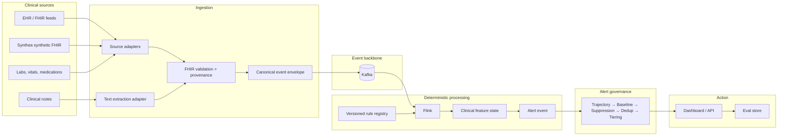

# Architecture

Why Curie is shaped the way it is, and how data flows through it. The decisions behind each invariant are
recorded in [`adr/`](adr/) — read those before "fixing" something that looks odd. The clinical/runtime
specifics live in [`contracts/`](contracts/) and [`governance/`](governance/); run/operate details in
[`operations/`](operations/) and [`runbooks/`](runbooks/).

## One-sentence shape

FHIR events flow **Kafka → Flink → deterministic score → shared governance → alert**, and an LLM may only
add narrative *after* an alert has already fired.

## Major components

| Component | Where | What it does |
|---|---|---|
| Ingestion adapters | `ingestion/adapters/` | Synthea, MIMIC demo, Challenge 2019 → canonical envelopes |
| Canonical envelope | `ingestion/envelope/` | One validated schema every source projects onto |
| Trusted-fact bridge | `ingestion/bridge/` | Admit/quarantine/reject clinical facts from `curie-fhir` |
| Kafka | `infra/docker-compose.yml` | Event backbone; topics `observations|conditions|medications|alerts|rules|dlq` |
| Flink jobs | `streaming/flink-jobs/` | Deterministic scoring + alert operators (SofaJob, AkiJob) |
| Rule registry | `streaming/rule-registry/` | Versioned JSON bundles + activation manifest (semver) |
| Governance | `streaming/flink-jobs/governance/` | Trajectory/baseline/suppression/dedup/tiering (shared) |
| Reference scorers | `eval/` | Python mirrors of the Java scoring, kept in parity (CURIE-007) |
| API + dashboard | `action/` | Read alerts/episodes, acknowledge, ops, CDS Hooks surface |
| GRP (LLM) | `reasoning/` | Post-alert narrative only, feature-flagged, additive |

## Data flow

1. A source adapter (or the trusted-fact bridge) emits a **canonical envelope** with `event_time` and
   `availability_time` onto a Kafka topic.
2. Flink consumes per-`patient_id` keyed streams, applies the active **rule bundle** (broadcast), and
   computes a deterministic score with explicit missing-component handling.
3. The score passes through the **event-time buffer** (`EventTimeBuffer`, allowed lateness 5m) so output is
   a function of the input event set, not arrival order.
4. The **governance layer** folds correlated signals, applies trajectory/baseline/suppression/dedup/
   tiering, and emits an alert (or routes late/poison events to `dlq`).
5. The alert is complete on its own: score, severity, evidence IDs, rule bundle id + version + hash.
6. Only then may GRP attach a narrative; it cannot create, suppress, or change anything in steps 2–5.

## Structural invariants (why it's shaped this way)

- **Governance is the product, not the score.** The publishable contribution is the shared layer that
  decides *whether to interrupt*, reused by every indicator. See ADR-0004.
- **LLM never on the alert path.** The deterministic alert ships with or without the model. See ADR-0001.
- **Two runtimes, one behavior.** Every scorer has a Python reference and a Java/Flink implementation that
  must match byte-for-byte on fixtures (parity gate, CI). See ADR-0002.
- **Deterministic over real-time.** Event-time ordering + allowed lateness, not arrival order, decide
  scores and governance. See ADR-0003.
- **Versioned rules, semver, never "latest" in production.** Every alert carries its rule version + hash.
  See ADR-0005.
- **Indicators are plugins, not new infrastructure.** A new condition is a rule bundle + plugin, not a new
  job or dashboard branch. See ADR-0006.

## Kafka topics

Created by `kafka-init`:

| Topic | Purpose |
|---|---|
| `observations` | FHIR Observation events |
| `conditions` | FHIR Condition events |
| `medications` | Medication* events |
| `alerts` | Deterministic alert events (post-governance) |
| `rules` | Rule-bundle broadcast / updates |
| `dlq` | Dead-letter / poison messages |

Partition key: `patient_id` (ordering per patient). Host producers use `localhost:9092`; containers
(Flink) use `kafka:29092`.
