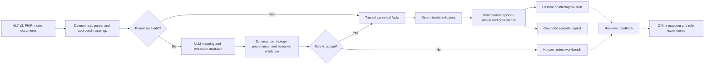

# Cross-project LLM workflow roadmap

**Status:** Proposed  
**Projects:**

- [`curie-fhir`](https://github.com/sreeram843/curie-fhir): legacy/unstructured data →
  validated FHIR R4 and human review.
- `curie-prediction-pipeline`: validated clinical events → deterministic signals, patient
  episodes, alert governance, and action surfaces.

## Product thesis

Use LLMs at ambiguous semantic and human-workflow boundaries. Keep scoring, temporal criteria,
episode transitions, and interruptive routing deterministic and versioned.

The combined product should provide three layers:

1. **Curie Connect:** adaptive clinical-data onboarding, validation, and exception handling.
2. **Curie Signal:** deterministic multi-condition surveillance and alert governance.
3. **Curie Copilot:** grounded explanations, review assistance, protocol retrieval, and feedback
   analytics.

## Hard safety boundary

An LLM must not directly:

- calculate or modify SOFA, KDIGO, or another deterministic score;
- open, resolve, suppress, escalate, or route a patient episode;
- choose a production threshold or activate a rule bundle;
- create a definitive diagnosis from unsupported text;
- generate uncited clinical facts or autonomous treatment instructions;
- promote an extracted fact to trusted clinical state without validation;
- process PHI through a service that lacks the required institutional approval and agreements.

Every LLM result must include model/prompt version, source provenance, confidence or abstention,
validation status, and an audit record. Model failure must not block deterministic alert delivery.

## Target architecture



## Workflow portfolio

### LLM-WF-01 — Hospital interface onboarding copilot

**Customer:** interface engineers and clinical informaticists.  
**Value:** reduce manual discovery and authoring for local HL7/FHIR mappings.

Inputs can include sample HL7 messages, interface specifications, local code dictionaries, target
FHIR profiles, and approved example outputs. The LLM proposes:

- source-to-target fields;
- terminology and unit mappings;
- FHIRPath or StructureMap transformations;
- unresolved fields and questions;
- confidence per mapping;
- golden tests and expected resources.

The approved proposal is compiled into a deterministic mapping. Production messages do not invoke
the LLM after a mapping is approved.

**Initial success metrics:** mapping-field acceptance rate, reviewer correction rate, time to an
approved mapping, generated-test coverage, and defects found in shadow replay.

### LLM-WF-02 — Deterministic-first conversion with LLM exception handling

**Customer:** integration operations.  
**Value:** preserve speed and repeatability for common traffic while handling malformed or novel
inputs without building every exception by hand.

Routing order:

1. Parse known message type and apply approved site mapping.
2. Run schema/profile, terminology, provenance, and semantic checks.
3. Invoke the LLM only for unknown fields, malformed messages, free text, or failed validation.
4. Revalidate the proposed repair.
5. Escalate unresolved or high-risk changes to human review.

**Initial success metrics:** deterministic fast-path rate, safe auto-repair rate, review rate,
repeat-error rate, p95 latency, cost per accepted resource, and post-review defect rate.

### LLM-WF-03 — Provenance-preserving note extraction

**Customer:** clinical informatics, surveillance, and research teams.  
**Value:** make context such as infection suspicion, baseline disease, or goals of care available as
reviewable structured facts.

Candidate facts should include:

- concept and code system;
- source note/resource ID and exact text span;
- patient/subject binding;
- author time, document time, clinical event time, and availability time;
- negation, experiencer, uncertainty, and temporality;
- normalized value/unit where applicable;
- confidence, abstention, model, prompt, and extraction-policy versions.

Outputs remain `candidate` until deterministic validation or human approval promotes them. The
prediction pipeline consumes only `trusted` facts and records their provenance.

**Initial success metrics:** span precision/recall, concept precision/recall, code accuracy,
negation/temporality accuracy, unsupported-fact rate, abstention quality, and reviewer agreement.

### LLM-WF-04 — Field-level FHIR semantic fidelity reviewer

**Customer:** data quality and safety reviewers.  
**Value:** detect cases that are structurally valid FHIR but do not faithfully represent the source.

The reviewer should produce field-level claims rather than one plausibility boolean:

```json
{
  "claims": [
    {
      "target_path": "Observation.valueQuantity.value",
      "value": 2.1,
      "source_id": "Note/456",
      "source_span": "creatinine increased to 2.1 mg/dL",
      "status": "supported"
    }
  ],
  "unsupported_target_fields": [],
  "omitted_source_facts": ["baseline creatinine 1.0 mg/dL"],
  "review_required": true
}
```

Judge failure or invalid output must return `unknown/review_required`, never default to safe.

**Initial success metrics:** unsupported-field detection, omission detection, false-review rate,
unsafe-representation recall, and agreement with dual human review.

### LLM-WF-05 — Human-review workbench copilot

**Customer:** interface and clinical-data operations.  
**Value:** turn exception handling into a scalable, auditable workflow and reusable mapping
knowledge.

For each item, show source and target side by side, validation history, unsupported fields, and a
minimal suggested patch. Cluster recurring errors by interface, message type, local code, and
target profile. After approval, generate a regression fixture and mapping-change proposal.

Reviewer dispositions should include accepted, corrected mapping, source parse error, terminology
error, insufficient information, duplicate, site configuration required, and clinically unsafe.

**Initial success metrics:** median review time, suggestion acceptance rate, repeat exceptions,
regression fixtures generated, and errors eliminated after mapping releases.

### LLM-WF-06 — Grounded multi-condition episode copilot

**Customer:** clinicians and surveillance teams.  
**Value:** explain one consolidated patient episode instead of presenting disconnected score events.

The deterministic episode arbiter supplies an immutable context containing active signals,
trajectory, routing decision, evidence, missing inputs, rule clauses, and versions. The LLM creates:

- what changed and over what interval;
- which signals support the episode;
- relevant context and possible alternatives already present in the evidence;
- important missing information;
- why the episode is passive or interruptive.

Every sentence-level claim must cite allowed evidence IDs. Unsupported output is quarantined; an
alert still ships without a narrative.

**Initial success metrics:** evidence-grounding precision, unsupported-claim rate, omission rate,
clinician usefulness, reading time, abstention rate, latency, and cost.

### LLM-WF-07 — Uncertainty-band context and differential assistant

**Customer:** surveillance reviewers.  
**Value:** examine context and possible mimics only when deterministic evidence is borderline or
conflicting.

Invoke it for a frozen uncertainty policy, not for every patient. It may identify source-grounded
context, possible alternatives, conflicts, and missing information. Begin in retrospective and
passive modes. It must not suppress or escalate deterministic alerts.

**Initial success metrics:** PPV and burden change in simulation, mimic-classification accuracy,
unsupported-claim rate, review usefulness, and subgroup performance.

### LLM-WF-08 — Site-approved protocol retrieval

**Customer:** clinicians.  
**Value:** make alerts actionable through approved local workflow information.

Retrieve only from a curated institutional knowledge base. Every result must cite protocol title,
version, section, effective/review dates, and authoritative link. Responses summarize approved
workflow and order-set availability; they do not independently prescribe treatment.

**Initial success metrics:** citation correctness, retrieval precision, stale-document rate,
clinician acceptance, time to intended workflow, and unsafe recommendation rate.

### LLM-WF-09 — Alert feedback and stewardship copilot

**Customer:** clinical decision-support governance teams.  
**Value:** convert acknowledgement and dismissal feedback into an evidence-based alert-improvement
backlog.

Classify feedback such as already recognized, already treated, chronic baseline, incorrect input,
appropriate but non-actionable, wrong recipient, repeated episode, and true escalation. Aggregate
by site, service, indicator, rule version, routing lane, and clinician role.

The LLM proposes offline experiments; it never changes an active rule or threshold. Every proposal
must be evaluated through frozen replay before human approval.

**Initial success metrics:** feedback classification agreement, actionability by category, repeat
page reduction after approved changes, sensitivity guardrails, and reviewer acceptance.

### LLM-WF-10 — Research cohort and adjudication copilot

**Customer:** clinical researchers.  
**Value:** accelerate phenotype review, error analysis, and reproducible study preparation.

Capabilities can include draft cohort queries, source-grounded case packets, infection-suspicion
evidence, false-positive/false-negative clustering, phenotype-version comparison, dual-review
adjudication support, and manuscript claim checks against frozen result artifacts.

LLM-generated labels are proposals, not ground truth. Studies should use independent reviewers,
adjudication, inter-rater agreement, and a locked test set.

## Cross-project integration contract

`curie-fhir` should publish candidate and trusted clinical facts through a versioned envelope. A
minimum payload should contain:

```json
{
  "event_id": "stable-id",
  "patient_id": "Patient/123",
  "encounter_id": "Encounter/456",
  "resource_type": "Observation",
  "clinical_event_time": "2026-08-12T10:00:00Z",
  "availability_time": "2026-08-12T10:04:00Z",
  "trust_status": "trusted",
  "source": {
    "system": "hospital-a",
    "resource_id": "Note/789",
    "spans": []
  },
  "extraction": {
    "method": "deterministic",
    "model": null,
    "prompt_version": null,
    "confidence": null
  },
  "validation": {
    "schema": "passed",
    "terminology": "passed",
    "provenance": "passed",
    "semantic_review": "not_required"
  },
  "idempotency_key": "source-version-and-fact-hash"
}
```

The prediction pipeline must reject or quarantine `candidate`, failed, unknown-schema, missing
provenance, and future-availability events. LLM metadata must never alter deterministic event-time
ordering.

## Recommended implementation order

1. **LLM-WF-02:** deterministic-first router in `curie-fhir`.
2. **LLM-WF-03:** provenance-preserving candidate-fact schema.
3. **Cross-project bridge:** trusted event envelope and contract tests — see
   [`trusted-clinical-fact-bridge.md`](trusted-clinical-fact-bridge.md) (CURIE-022).
4. **LLM-WF-05:** human-review workbench and feedback capture.
5. **LLM-WF-06:** grounded patient-episode narrative in the prediction pipeline.
6. **LLM-WF-01:** mapping proposal and deterministic compiler workflow.
7. **LLM-WF-09:** feedback analytics and offline rule experiments.
8. **LLM-WF-04/07/08/10:** only after their validation datasets and governance are ready.

## Release gates for an LLM workflow

- [ ] Intended user, decision, and prohibited use are documented.
- [ ] Output schema supports abstention and source-level provenance.
- [ ] Deterministic and human validation paths are defined.
- [ ] Failure, timeout, malformed output, prompt injection, and unavailable-model tests pass.
- [ ] Offline evaluation includes a frozen test set and subgroup/error analysis.
- [ ] Model, prompt, retrieval corpus, and policy versions are auditable.
- [ ] PHI boundary, retention, access control, and vendor agreements are approved.
- [ ] Shadow-mode thresholds and rollback/kill-switch behavior are documented.
- [ ] Product claims match measured evidence.

