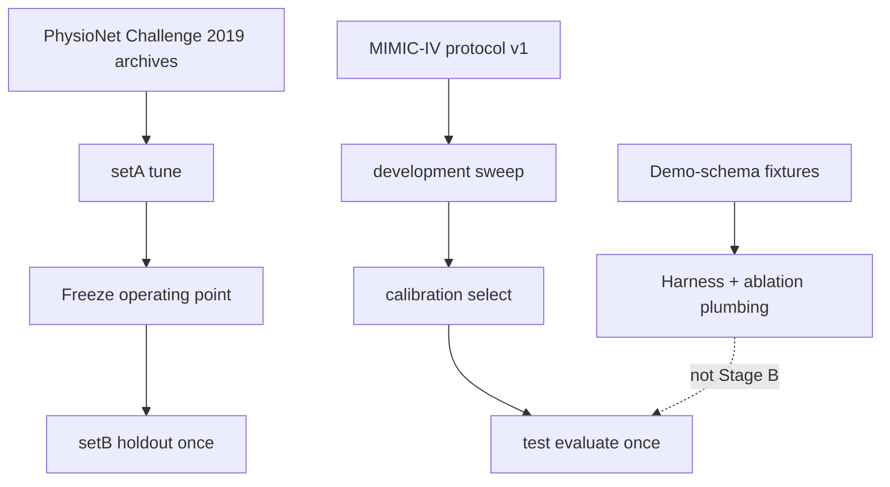

# Manuscript package (CURIE-020)

**Status:** Research writeup skeleton + regenerable artifacts (not a submitted paper)  
**Builder:** `make manuscript` / `python -m eval.manuscript.package build`  
**Frozen:** [`eval/manuscript/frozen/reproducibility_manifest.v1.json`](../../eval/manuscript/frozen/reproducibility_manifest.v1.json)
**Generated tables:** [`eval/manuscript/generated/tables.md`](../../eval/manuscript/generated/tables.md)

> Prototype evaluation package. Separates **retrospective detection**, **alert-policy utility**, and **unproven clinical outcome effects**. Does not claim diagnosis, outcome improvement, clinical validation, or regulatory clearance.

---

## 1. Claim tiers (lock language before figures)

| Tier | Status | What may be stated |
|---|---|---|
| Retrospective detection | Demonstrated on public Challenge aggregates + demo-schema fixtures | Sensitivity / timing under frozen windows |
| Alert-policy utility | Demonstrated as burden metrics | Interruptive reduction, NNA, ablations |
| Clinical outcome effects | **Not claimed** | Mortality, LOS, antibiotics, FDA/SaMD, diagnosis |

Full machine-readable tiers live in the reproducibility manifest `claim_tiers` field.

---

## 2. Methods and protocol pins

| Item | Pin |
|---|---|
| Code | Git SHA recorded at `make manuscript` time (`git_sha` in manifest) |
| MIMIC study protocol | [`docs/mimic-iv-study-protocol.md`](./mimic-iv-study-protocol.md) + `eval/mimic_study/frozen/protocol.v1.json` |
| Challenge operating point | `eval/challenge2019/frozen/p1_setA_winner.json` (+ bundle SHA) |
| Timing definitions | `eval/challenge2019/frozen/timing_primary.v1.json` (`window_m12_p6`) |
| Demo MIMIC study | `eval/mimic_study/frozen/study_manifest.v1.json` |
| Selection rule | Tune on setA / development+calibration only; **never** on setB / test |

Exact content hashes for every pinned artifact are written into the reproducibility manifest. Protected MIMIC extracts are **not** committed; Stage B requires local PhysioNet access under DUA.

---

## 3. Cohort flow



- **Challenge:** public hourly ICU stays; aggregates only in git.  
- **MIMIC-IV:** protocol frozen; full extract path documented, data not in repo.  
- **Demo schema:** CURIE-015/016 plumbing for leakage + ablation regeneration.

---

## 4. Figures (specs in `figure_specs.v1.json`)

| Figure | Source | Notes |
|---|---|---|
| Operating-point / Pareto | Calibration candidates + Challenge setA winner | x = interruptive reduction, y = governed sensitivity |
| Timing | `timing_primary` + mean lead hours | Primary window `[-12h, +6h]` around label_start |
| Calibration | Demo OP `calibration` block | Selection metrics — **not** probability reliability |
| Ablation | Demo `test_ablations` | Regenerated by `make mimic-study` then `make manuscript` |

Render publication plots offline from `eval/manuscript/generated/figure_specs.v1.json` if needed; CI only requires the JSON specs.

---

## 5. Tables

See generated [`tables.md`](../../eval/manuscript/generated/tables.md) for:

- Ablation table (demo-schema test)
- Operating-point / Pareto candidates
- Subgroup placeholders (Challenge aggregates + Stage B planned)
- Failure analysis (partial SOFA, label semantics, page gate, watch volume)

---

## 6. Results narrative (honest)

### 6.1 Retrospective detection

- Challenge setA (frozen winner): governed sensitivity matches naive under the locked knobs (see `p1_setA_winner.json`).  
- Holdout setB narrative and CIs: [`challenge-2019-eval.md`](./challenge-2019-eval.md) — re-run for `window_m12_p6` primary if citing new numbers.  
- Demo MIMIC test: PE-1 plumbing holds on tiny fixtures; **not** clinical evidence.

### 6.2 Alert-policy utility

- Interruptive reduction is the burden co-primary (Challenge setA burden ratio in frozen OP; holdout documented in eval doc).  
- Ablations show which knobs move interruptive sensitivity vs volume on demo fixtures.

### 6.3 Clinical outcomes

**Not claimed.** No mortality, organ-failure, or treatment-process endpoints are estimated in this package.

---

## 7. Reproducibility (no protected MIMIC data)

```bash
make manuscript          # rebuild manifest + tables + figure specs
make manuscript-phi      # fail if PHI-like patterns appear
make mimic-study         # regenerate demo study frozen artifacts
# Challenge holdout (requires local data/archive; outputs stay gitignored):
# GOV_CONFIG=eval/challenge2019/frozen/p1_setA_winner.json SET=training_setB LIMIT=0 make challenge-2019
```

`python -m eval.manuscript.package phi-scan` must pass before publishing the package.

---

## 8. Related docs

- [`clinical-validation.md`](./clinical-validation.md) — evidence stages A–F  
- [`mimic-ablation-study.md`](./mimic-ablation-study.md) — CURIE-016
